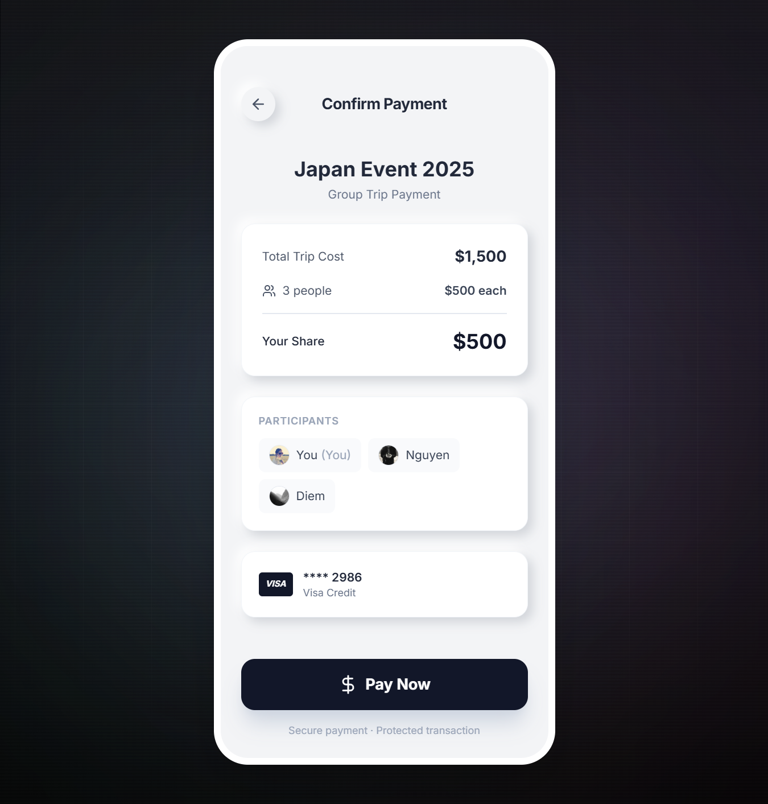

# ConceptPaymentUX 🎯

A modern split payment concept that brings tangible feedback to digital transactions through an animated thermal receipt printing experience.




## 🌟 Live Demo

**[View Live Demo →](https://shahnab.github.io/ConceptPaymentUX/)**

## 💡 Concept

This project explores how we can make digital payments feel more tangible and trustworthy by simulating a physical thermal printer receipt. As your payment processes, watch a realistic receipt emerge with authentic paper texture, perforation marks, and tear edges.

### Key Features

- **Real-time Receipt Printing Animation** - Watch the invoice print as payment processes
- **Minimalistic Confirmation Flow** - Clean two-step payment process
- **Authentic Paper Design** - Thermal paper texture, grain, perforation holes, and jagged tear edges
- **3D Visual Effects** - Neomorphic design with realistic paper emergence animation
- **Payment Tracking** - Clear visual status for each participant (paid/pending)
- **Professional Dark Theme** - Ambient background with animated mesh gradients

## 🎨 Design Highlights

### Confirmation Page
- Clean breakdown of trip costs
- Participant list with avatars
- Payment method selection
- Neomorphic card design with 3D shadows

### Receipt Animation
- Thermal printer simulation with realistic paper emergence
- Progress indicator during printing
- Authentic receipt paper characteristics:
  - Paper grain and fiber texture
  - Glossy thermal coating sheen
  - Edge perforation marks
  - Realistic jagged tear line at bottom
  - Subtle aging and handling marks
- Participant payment status with visual indicators

## 🚀 Getting Started

### Prerequisites
- Node.js (v16 or higher)
- npm or yarn

### Installation

1. Clone the repository
```bash
git clone https://github.com/Shahnab/ConceptPaymentUX.git
cd ConceptPaymentUX
```

2. Install dependencies
```bash
npm install
```

3. Run development server
```bash
npm run dev
```

The app will be available at `http://localhost:3000`

### Build for Production

```bash
npm run build
```

## 📦 Deployment

This project is deployed on GitHub Pages.

### Deploy to GitHub Pages

1. Ensure you have pushed your code to GitHub
```bash
git add .
git commit -m "Your commit message"
git push origin main
```

2. Deploy to GitHub Pages
```bash
npm run deploy
```

The site will be published at: `https://[your-username].github.io/ConceptPaymentUX/`

### Configuration for GitHub Pages

The project is configured with:
- `base: '/ConceptPaymentUX/'` in `vite.config.ts`
- `gh-pages` package for automated deployment
- Deploy script in `package.json`

## 🛠️ Tech Stack

- **React** - UI framework
- **TypeScript** - Type safety
- **Vite** - Build tool
- **Tailwind CSS** - Styling (utility classes)
- **Lucide React** - Icons

## 📱 Features Breakdown

### Two-Page Flow
1. **Confirmation Page** - Review and confirm payment details
2. **Receipt Page** - Watch payment process with printing animation

### UX Enhancements
- 3-second printing animation (60fps)
- Smooth 3D transforms with perspective
- Paper curl effect with rotateX
- Status bar showing printing progress
- Dynamic shadow based on paper position
- Perforation marks and tear edge details

## 🎯 Use Case

Perfect for:
- Split trip expenses among friends
- Group event payments
- Shared accommodation costs
- Any scenario requiring transparent group payment tracking

## 🔮 Future Enhancements

- [ ] Add payment gateway integration
- [ ] Enable custom trip details editing
- [ ] Add email/SMS reminder functionality
- [ ] Support multiple currencies
- [ ] Add receipt download/share options
- [ ] Implement receipt history

## 📄 License

This project is open source and available under the MIT License.

## 👤 Author

**Shahnab**
- GitHub: [@Shahnab](https://github.com/Shahnab)

## 🤝 Contributing

Contributions, issues, and feature requests are welcome!

---

**Note:** This is a UI/UX concept project focused on design and user experience. No actual payment processing is implemented.
